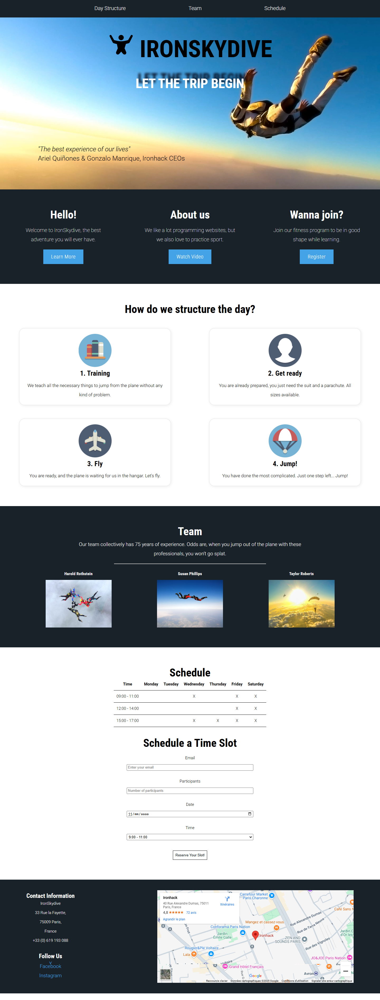

# Ironhack_IronSkydive_exercice
Guided exercise : IronSkydive - Based on Ironhack Bootcamp exercice.

## Table of contents

- [Overview](#overview)
  - [The instruction](#the-instruction)
  - [Screenshot](#screenshot)
  - [Links](#links)
- [My process](#my-process)
  - [Built with](#built-with)
  - [What I learned](#what-i-learned)
- [Author](#author)

## Overview

### The instruction

The instruction is to bluid a simple HTML & CSS page for the IronSkydive company and get it looking as close to the design as possible. It's a landing page that include a navigation bar, a hero section, others sections, a form and a footer. You can use any tools you like to help you complete the challenge. So, if you have something you'd like to practice, feel free to give it a go.

### Screenshot

### Links

- Solution Repository URL: [Click here](https://github.com/CannyRo/Ironhack_IronSkydive_exercice)

## My process

### Built with

- Semantic HTML5 markup
- CSS custom properties
- Flexbox

### What I learned

Nothing in particular with this challenge.

## Author

- Website - [WhatCannyDev is searching a work-study contract in France](https://cannyro.github.io/hire_mr_canny/en)
- GitHub - [@CannyRo](https://github.com/CannyRo)
- LinkedIn - [Ronan CANNY](https://www.linkedin.com/in/ronan-canny-b29443277/)
